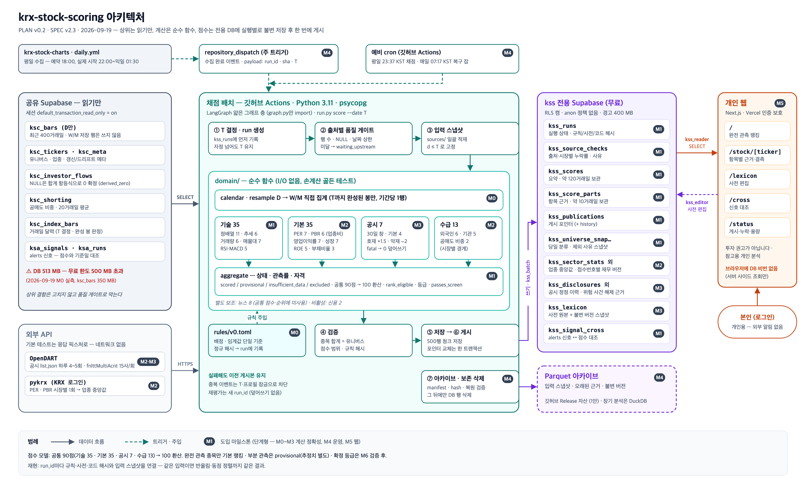
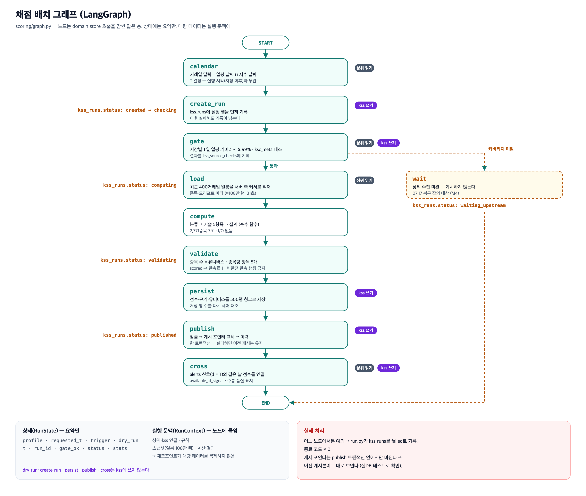

# krx-stock-scoring

[English](README.md) · **한국어**

KOSPI·KOSDAQ 전 종목에 매 거래일 **규칙 기반 상태 점수**를 매기는 배치.

거래일마다 입력을 스냅샷으로 고정하고, 전 종목을 다섯 축 100점으로 채점한 뒤, 어떤 규칙 파일·어떤
원자료 행·어떤 보고서 버전에서 나온 값인지 되짚을 수 있는 형태로 불변 게시한다.

> **상태: 진행 중 (마일스톤 8개 중 M0~M2).** 점수는 `experimental`로 표시되며, M6 검증 보고서가
> 통과하기 전에는 확정 등급을 게시하지 않는다. 개인 학습·분석용이며 **투자 자문이 아니고**
> 자동매매 시스템도 아니다.

---

## 무엇을 하는가

- 매일 KOSPI·KOSDAQ 유니버스(약 2,770종목)를 스냅샷으로 남기고, 모든 종목을 `scored`·`provisional`·
  `insufficient_data`·`excluded` 중 하나의 상태로 둔다. 조용히 사라지는 종목이 없다.
- 다섯 축 **100점**을 환산 없이 원점수로 매긴다. 뉴스는 음수가 될 수 있어 총점이 0 미만일 수 있고,
  이를 0으로 자르지 않는다.
- 항목마다 **실제로 관측한 것**을 남긴다 — 원입력 값, 결측일 수, 건너뛴 이유까지. 저장된 근거만으로
  점수를 다시 유도할 수 있다.
- 공표 지표를 믿지 않고 최신 DART 보고서에서 밸류에이션을 직접 계산한다
  ([PER을 직접 계산하는 이유](#per을-직접-계산하는-이유)).
- 게시는 원자적이다. 실행이 자기 행을 모두 쓴 뒤 advisory lock 아래에서 포인터를 바꾸므로, 읽는 쪽이
  절반만 쓰인 하루를 보는 일이 없다.

### 배점 모델 (rules v0, 100점)

| 축 | 배점 | 항목 |
|---|---:|---|
| 기술 | **35** | 정배열 11 · 추세 6 · 거래량 6 · 가격대별 거래량 7 · RSI·MACD 5 |
| 기본 | **36** | PER 6 · PBR 5 · 영업이익률 7 · 성장률 6 · ROE 5 · 부채비율 3 · 배당수익률 4 |
| 공시 | **7** | 30일 창의 DART 공시 |
| 수급 | **13** | 외국인 6 · 기관 5 · 공매도 거래 비중 2 |
| 뉴스 | **9** | 관련 기사 3건 × ±3 (−9 ~ +9) |

신용 2점은 정의해 두었으나 비활성이다. 프로필로 일부 축만 먼저 돌릴 수 있다 — `technical`(35),
`partial`(84 = 기술+기본+수급), `common`(100).

---

## 알아둘 만한 설계 결정

**규칙의 단일 기준.** `rules/v0.toml`이 임계값·창·단계·반올림을 전부 들고 있다. 정렬을 고정한 해시로
식별하며 실행마다 함께 저장한다 — 해시가 다른 실행의 점수를 같은 시계열로 잇지 않는다. 테스트는 SPEC에서
독립적으로 옮겨 적은 배점표와 대조하므로, 규칙 파일이 명세에서 조용히 멀어질 수 없다.

**결측은 0이 아니다.** 투자자 수급 행이 비는 이유는 그 부류의 거래가 없었기 때문일 수도, 상위 수집이
실패했기 때문일 수도 있다. 투자자 5부류의 순매수 합은 0이라는 항등식이 있으므로, **같은 행의 나머지 값
합이 이미 0일 때만** NULL을 0으로 확정한다(`derived_zero`). 그렇지 않으면 그날은 결측이고, 항목이
관측률 하한 아래로 떨어질 수 있다.

**연속 순매수는 결측일을 건너뛰지 않는다.** 결측을 만나면 거기서 끊는다 — 수집 장애가 신호를 만들어내지
못하게 한다.

**모든 실행은 불변이다.** 점수·근거 행·재무 보고서 버전·corpCode 매핑을 실행 단위로 저장하고 내용 해시로
보존한다. 바뀐 것이 없는 날을 다시 돌려도 행이 늘지 않는다. 오래된 상세는 지우지 않고 Parquet로 보관한다.

### PER을 직접 계산하는 이유

KRX가 공표하는 PER·PBR·ROE는 **직전 사업보고서** 기준이라 연중 대부분 낡아 있다. 2026-09-18 삼성전자의
공표 PER은 39.52였지만 최근 4분기 합산 기준으로는 **11.47**이었다 — 순위가 통째로 뒤집힐 만한 차이다.

그래서 기본 축 7항목 중 6개를 최신 DART 보고서에서 직접 계산한다. 국내 포털이 쓰는 정의를 따랐다.

- **TTM 순이익** = 직전 사업연도 + 당기 누적 − 전년 동기 누적. 비교 기간을 구할 수 없으면 연환산으로 폴백.
- **EPS** = TTM 순이익 ÷ 수정평균발행주식수, **보통주와 우선주를 합산**.
- **BPS** = 최근 분기 자본총계 ÷ 같은 합산 주식수.
- **ROE** = TTM 순이익 ÷ 평균 자본.

배당수익률만 예외로 KRX 공표값(`DIV`)을 그대로 쓰고 `DPS`를 근거에 남긴다. 실측 적용 범위는
TTM 2,499종목 · 연환산 폴백 44 · 사업보고서 17 · 계산 불가 25이다.

---

## 아키텍처



배치는 상위 데이터를 **읽기 전용**으로만 연다(세션을 `default_transaction_read_only=on`으로 시작).
쓰기는 전용 Supabase 프로젝트의 `kss_*` 표에만 한다.

| 출처 | 쓰임 | 접근 |
|---|---|---|
| `krx-stock-charts` (`ksc_*`) | 일봉·투자자 수급·공매도·시가총액·지수 | 읽기 전용 |
| `krx-signal-alerts` (`ksa_*`) | 신호 기준일과 점수 기준일 대조 | 읽기 전용 |
| OpenDART | 재무제표·공시 | REST |
| KRX (pykrx) | 배당수익률 (`DIV`·`DPS`) | 로그인 필요 |

파이프라인은 얇은 [LangGraph](docs/GRAPH.md) 그래프로 엮여 있다 — `scoring/graph.py`만 LangGraph를
import하고, 대량 데이터는 그래프 상태에 넣지 않는다.



---

## 기술 스택

Python 3.11+ · psycopg 3 · LangGraph · pykrx · Supabase (PostgreSQL) · pytest · ruff · mypy(strict)

---

## 시작하기

```bash
python3 -m venv venv && source venv/bin/activate     # Windows: venv\Scripts\activate
pip install -r requirements-dev.txt
cp .env.example .env                                  # 값은 직접 채운다
```

`.env`에는 상위 DB 읽기 전용 접속 문자열, 전용 점수 DB, OpenDART 키, 스키마 적용에 쓰는 롤 비밀번호,
pykrx용 KRX 계정이 필요하다. 이름과 주의사항은 [.env.example](.env.example)에 있고, 값은 리포에 넣지 않는다.

스키마를 적용한 뒤 하루를 돌린다.

```bash
python scripts/apply_schema.py                        # 표 11개, RLS 전부 켬, anon 정책 없음
python -m scoring.run score --profile partial --dry-run       # 계산만, 쓰지 않는다
python -m scoring.run score --profile partial --date 2026-09-18
python -m scoring.run score --profile technical --tickers 005930,000660
```

### 검증

```bash
ruff check .
mypy                 # scoring · scripts · tests (pyproject)
pytest tests/ -v
```

현재 테스트 170개가 통과한다. 단위 테스트 외에 `scripts/m2_crosscheck.py`가 무작위 20종목을 파이프라인
코드를 쓰지 않고 처음부터 다시 구한다 — DART를 다시 호출하고 수급을 SQL로 다시 세어 게시본과 대조한다.
마지막 실행에서 109건을 검사해 불일치 0건이었다.

---

## 저장소 구조

```
scoring/
  run.py            CLI 진입점
  graph.py          LangGraph 배선 (이 파일만 import한다)
  nodes.py          단계: 적재 → 채점 → 저장 → 게시
  rules.py          규칙 파일 적재·검증·정규 해시
  domain/           순수 채점 함수 (기술·기본·재무·수급·집계)
  sources/          DART·KRX·corpCode 어댑터
  store/            schema.sql과 저장기
rules/v0.toml       임계값·배점의 단일 기준
scripts/            스키마 적용·실측·수작업 대조·그림 생성
docs/               SPEC · PLAN · TASKS · GRAPH
tests/              픽스처 회귀 테스트를 포함한 170개
```

설계 문서: [SPEC](docs/SPEC.md)(요구사항·배점 모델), [PLAN](docs/PLAN.md)(아키텍처·마일스톤),
[TASKS](docs/TASKS.md)(진도율·트러블슈팅 기록).

---

## 진행 상황

| 마일스톤 | 범위 | 상태 |
|---|---|---|
| M0 | 상위 실측·계약·뼈대 | ✅ 2026-09-19 |
| M1 | 유니버스·기술 35·최소 저장 | ✅ 완료, 확인 대기 |
| M2 | 기본 36·수급 13·규칙 확정 | ✅ 완료, 확인 대기 |
| M3 | 공시 7·사전·뉴스 9 | 예정 |
| M4 | 운영·게시·복구 | 예정 |
| M5 | 웹 대시보드(접근 보호) | 예정 |
| M6 | 점수 검증·출시 판정 | 예정 |
| M7 | scorer MCP | 예정 |

최근 전 종목 실행(`partial` 프로필 84점, 2026-09-18): 전 시장 148초 —
scored 2,084 · 잠정 132 · 자료 부족 369 · 제외 186, 근거 41,565행.

---

## 고지

개인 학습·분석용 도구다. 가격을 예측하거나 매매를 권유하지 않고, 목표가·진입/청산 수준을 내지 않는다.
점수는 종목의 현재 상태를 규칙으로 서술한 값이며, M6 검증 전까지 `experimental` 상태다.
투자 자문으로 읽어서는 안 된다.
