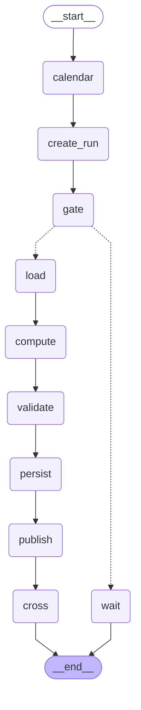

# GRAPH.md — 채점 배치 그래프 (자동 생성)

> `scripts/export_graph.py`가 `scoring/graph.py`의 컴파일된 그래프에서 만든다.
> **직접 고치지 않는다.**
> 설명과 그림은 `PLAN.md` §2.3.

```mermaid
---
config:
  flowchart:
    curve: linear
---
graph TD;
	__start__([<p>__start__</p>]):::first
	calendar(calendar)
	create_run(create_run)
	gate(gate)
	load(load)
	compute(compute)
	validate(validate)
	persist(persist)
	publish(publish)
	cross(cross)
	wait(wait)
	__end__([<p>__end__</p>]):::last
	__start__ --> calendar;
	calendar --> create_run;
	compute --> validate;
	create_run --> gate;
	gate -.-> load;
	gate -.-> wait;
	load --> compute;
	persist --> publish;
	publish --> cross;
	validate --> persist;
	cross --> __end__;
	wait --> __end__;
	classDef default fill:#f2f0ff,line-height:1.2
	classDef first fill-opacity:0
	classDef last fill:#bfb6fc
```
